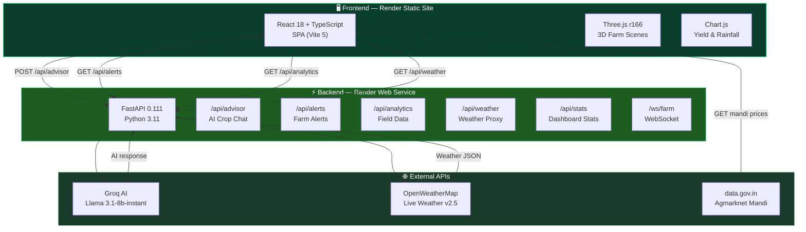
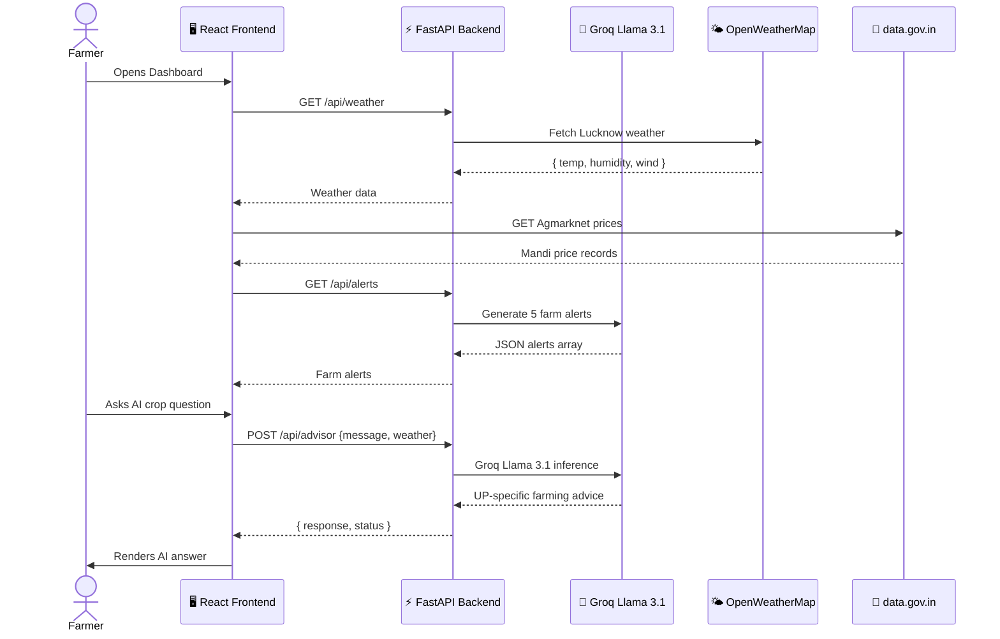
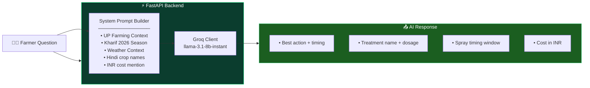
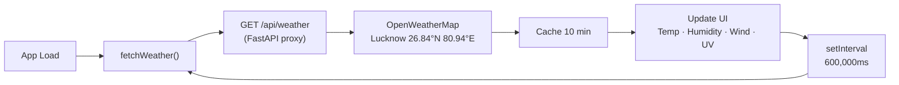
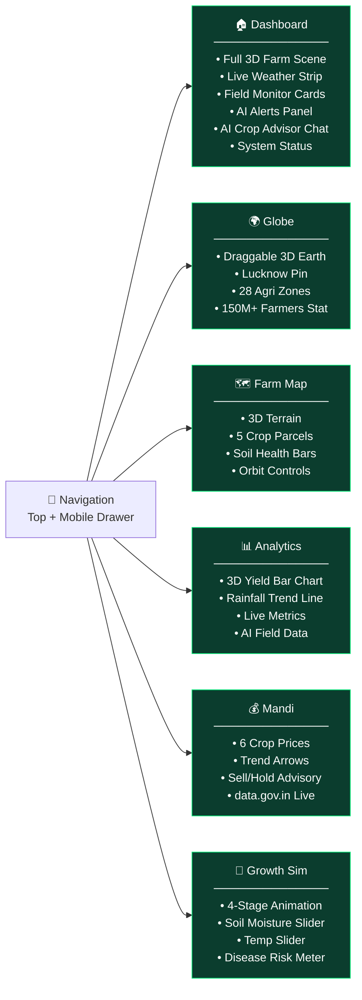
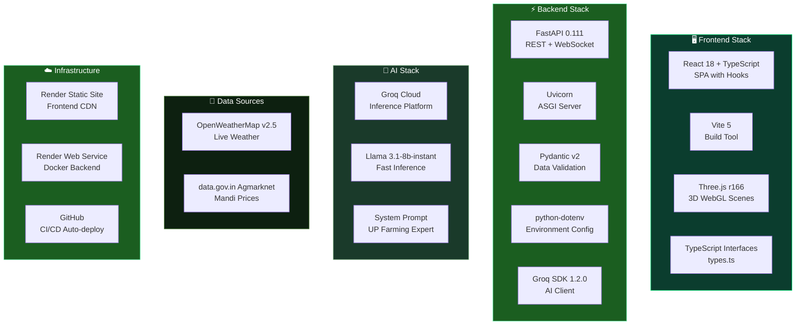

<div align="center">

```
█████╗  ██████╗ ██████╗  ██████╗ ███╗   ███╗██╗███╗   ██╗██████╗ 
██╔══██╗██╔════╝ ██╔══██╗██╔═══██╗████╗ ████║██║████╗  ██║██╔══██╗
███████║██║  ███╗██████╔╝██║   ██║██╔████╔██║██║██╔██╗ ██║██║  ██║
██╔══██║██║   ██║██╔══██╗██║   ██║██║╚██╔╝██║██║██║╚██╗██║██║  ██║
██║  ██║╚██████╔╝██║  ██║╚██████╔╝██║ ╚═╝ ██║██║██║ ╚████║██████╔╝
╚═╝  ╚═╝ ╚═════╝ ╚═╝  ╚═╝ ╚═════╝ ╚═╝     ╚═╝╚═╝╚═╝  ╚═══╝╚═════╝ 
```

### 🌱 *AI-Powered Smart Farming Intelligence — Built for Indian Farmers* 🌱

<br/>

[](https://agromind3d-1.onrender.com)
[](https://agromind3d.onrender.com/api/health)
[](https://github.com/zara650/agromind3d)

<br/>


<br/>

> **AgroMind 3D** is a full-stack AI-powered smart farming dashboard built for Indian farmers.  
> Features a live 3D farm scene, Groq AI crop advisor, real mandi prices, live weather,  
> plant growth simulation, and a FastAPI backend — all deployed and running live.

<br/>

---

</div>

<br/>

## 🗺️ Table of Contents

- [🚀 Live Deployment](#-live-deployment)
- [✨ Feature Overview](#-feature-overview)
- [🏗️ System Architecture](#️-system-architecture)
- [🤖 AI Crop Advisor](#-ai-crop-advisor)
- [🌍 3D Visualizations](#-3d-visualizations)
- [📡 REST API Reference](#-rest-api-reference)
- [🌾 Farm Intelligence](#-farm-intelligence)
- [🎨 Frontend & Pages](#-frontend--pages)
- [⚙️ Local Development](#️-local-development)
- [☁️ Deployment Guide](#️-deployment-guide)
- [🔑 Environment Variables](#-environment-variables)
- [📦 Tech Stack](#-tech-stack)

<br/>

---

## 🚀 Live Deployment

<br/>

```
╔══════════════════════════════════════════════════════════════════════╗
║  🌐  Frontend   →   https://agromind3d-1.onrender.com               ║
║  ⚡  Backend    →   https://agromind3d.onrender.com/api/health       ║
║  📦  GitHub     →   https://github.com/zara650/agromind3d           ║
╚══════════════════════════════════════════════════════════════════════╝
```

| Layer | URL | Status |
|-------|-----|--------|
| 🖥️ **Frontend** | [agromind3d-1.onrender.com](https://agromind3d-1.onrender.com) | ✅ Live |
| ⚡ **Backend API** | [agromind3d.onrender.com/api/health](https://agromind3d.onrender.com/api/health) | ✅ Live |
| 🌤️ **Weather API** | OpenWeatherMap · Lucknow, UP | ✅ Live |
| 🏪 **Mandi API** | data.gov.in · Agmarknet | ✅ Live |

✔ Fully deployed full-stack application on Render  
✔ Real-time AI + live weather + mandi price integration  
✔ Production-ready with FastAPI backend + React TypeScript frontend

<br/>

---

## ✨ Feature Overview

<br/>

```
╔══════════════════════╦══════════════════════╦══════════════════════╗
║  🤖 GROQ AI ADVISOR  ║  🌍 THREE.JS 3D FARM ║  🌤️ LIVE WEATHER     ║
║  Llama 3.1 Powered   ║  Animated Farm Scene ║  OpenWeatherMap API  ║
╠══════════════════════╬══════════════════════╬══════════════════════╣
║  💰 MANDI PRICES     ║  📊 FARM ANALYTICS   ║  🌱 GROWTH SIM       ║
║  data.gov.in Live    ║  Yield & Soil Data   ║  Seed → Harvest      ║
╠══════════════════════╬══════════════════════╬══════════════════════╣
║  🗺️ FARM MAP 3D      ║  🌐 EARTH GLOBE      ║  ⚡ FASTAPI BACKEND  ║
║  5 Crop Parcels      ║  Lucknow Pinned      ║  Secure AI Proxy     ║
╚══════════════════════╩══════════════════════╩══════════════════════╝
```

<br/>

| Feature | Description | Status |
|---|---|---|
| 🤖 AI Crop Advisor | Groq Llama 3.1 — disease, spray timing, pest management for UP farming | ✅ Live |
| 🌍 3D Farm Scene | Full animated farm — barn, silo, tractor, cows, drone patrol, crop rows | ✅ Live |
| 🌤️ Live Weather | Real-time temp, humidity, wind, UV index for Lucknow UP | ✅ Live |
| 💰 Mandi Prices | Live Agmarknet prices — Wheat, Rice, Cotton, Sugarcane with trends | ✅ Live |
| 📊 Farm Analytics | 3D yield bar chart, rainfall trends, soil health, field metrics | ✅ Live |
| 🌐 Interactive Globe | Draggable 3D Earth with Lucknow farm location pinned | ✅ Live |
| 🗺️ Farm Map | 3D terrain with 5 clickable crop parcels + soil health bars | ✅ Live |
| 🌱 Growth Simulation | Seed → Sprout → Sapling → Harvest with disease risk meters | ✅ Live |
| ⚡ FastAPI Backend | Secure Python backend — AI keys never exposed to browser | ✅ Live |
| 📱 Responsive | Works on desktop and mobile | ✅ Live |

<br/>

---

## 🏗️ System Architecture

<br/>



<br/>

### 🔁 Request Lifecycle



<br/>

---

## 🤖 AI Crop Advisor

AgroMind uses **Groq's Llama 3.1-8b-instant** model via a secure FastAPI backend. The AI is tuned specifically for Uttar Pradesh farming conditions, Kharif 2026 season.

<br/>



<br/>

### System Prompt Design

```
You are AgroMind AI, expert agricultural advisor for Indian farmers
in Lucknow UP India. Season: Kharif 2026.

Rules:
• Reply in 2-4 short bullet points
• Be practical and specific to UP farming
• Use Indian crop names (Gehun, Dhan, Kapas, Ganna)
• If disease: give treatment name, dosage, spray timing
• Always mention: best action, timing, cost in INR
• Consider current weather context
```

### Example Interaction

**Farmer asks:** *"What should I spray on cotton for blight?"*

**AgroMind AI responds:**
```
For cotton blight in Kharif 2026 in UP, I recommend:

• Best action: Spray Mancozeb 75 WP — dissolve 2g in 1L water
  at 10-12 day intervals. Cost: ₹180-220/kg
• Timing: Spray early morning (6-9 AM) or late evening to
  avoid direct sunlight — improves absorption
• Second option: Copper Oxychloride 50 WP at 3g/L water
  if infection is severe. Cost: ₹150/kg
• Prevention: Ensure proper drainage and avoid overhead
  irrigation during humid conditions
```

<br/>

---

## 🌍 3D Visualizations

AgroMind features **4 independent Three.js scenes** across 6 pages:

<br/>

### Dashboard Farm Scene

```
┌─────────────────────────────────────────────────────────┐
│  Full-screen animated 3D farm                           │
│  Objects:                                               │
│    • Red barn with roof + windows                       │
│    • Grain silo (cylinder)                              │
│    • Red tractor (animated movement)                    │
│    • 2 cows wandering with collision avoidance          │
│    • Crop rows (wheat/corn geometry)                    │
│    • Drone on patrol path                               │
│    • Autumn trees (5 varieties)                         │
│    • Fence perimeter                                    │
│    • Sky with clouds                                    │
│  Lighting: AmbientLight + DirectionalLight (sun)        │
│  Controls: OrbitControls with auto-rotate               │
└─────────────────────────────────────────────────────────┘
```

### Interactive Globe Scene

```
┌─────────────────────────────────────────────────────────┐
│  Draggable 3D Earth globe                               │
│  • Real earth texture mapped on sphere                  │
│  • Lucknow, UP location pin (26.8467°N, 80.9462°E)     │
│  • Agricultural zone markers (28 zones)                 │
│  • 150M+ farmers statistic overlay                      │
│  • Smooth drag rotation + pinch zoom                    │
└─────────────────────────────────────────────────────────┘
```

### 3D Farm Parcel Map

```
┌─────────────────────────────────────────────────────────┐
│  Interactive 3D terrain with crop fields                │
│  5 clickable parcels:                                   │
│    F-001 Wheat Field    — 2.5 acres                     │
│    F-002 Rice Paddy     — 3.0 acres                     │
│    F-003 Cotton Zone    — 4.0 acres                     │
│    F-004 Sugarcane      — 1.8 acres                     │
│    F-005 Veg Garden     — 1.2 acres                     │
│  Hover: tooltip with yield, health, status              │
│  OrbitControls: full 360° + zoom                        │
└─────────────────────────────────────────────────────────┘
```

### 3D Yield Bar Chart

```
┌─────────────────────────────────────────────────────────┐
│  Animated 3D bar chart                                  │
│  • Bars grow from 0 on page load                        │
│  • Hover highlight effect                               │
│  • Monthly crop yield data                              │
│  • Color-coded by crop type                             │
└─────────────────────────────────────────────────────────┘
```

<br/>

---

## 📡 REST API Reference

**Base URL (Production):** `https://agromind3d.onrender.com`

<br/>

### System Endpoints

| Method | Endpoint | Description |
|---|---|---|
| `GET` | `/api/health` | Health check — returns status, version, model |
| `GET` | `/api/stats` | Dashboard stats — messages, alerts, queries |

<br/>

#### `GET /api/health` — Health Check

```http
GET https://agromind3d.onrender.com/api/health
```

```json
{
  "status": "online",
  "version": "2.0.0",
  "model": "llama-3.1-8b-instant"
}
```

<br/>

#### `GET /api/stats` — Dashboard Stats

```http
GET /api/stats
```

```json
{
  "messages": "1,247",
  "alerts": "23",
  "queries": "418",
  "status": "ok"
}
```

<br/>

---

### AI Endpoints

| Method | Endpoint | Description | Body |
|---|---|---|---|
| `POST` | `/api/advisor` | Ask AI crop advisor | `{"message": "...", "weather": "31C humid"}` |
| `GET` | `/api/alerts` | Get 5 live farm alerts | — |
| `GET` | `/api/analytics` | Get field analytics data | — |

<br/>

#### `POST /api/advisor` — AI Crop Advisor

```http
POST /api/advisor
Content-Type: application/json

{
  "message": "What should I spray on cotton for blight?",
  "weather": "37°C, humid, Lucknow UP"
}
```

```json
{
  "response": "• Best action: Spray Mancozeb 75 WP at 2g/L water...\n• Timing: Early morning 6-9 AM...\n• Cost: ₹180-220/kg",
  "status": "ok"
}
```

**Error Responses:**

| HTTP | Condition |
|---|---|
| `500` | Groq API error |
| `503` | Backend unavailable |

<br/>

#### `GET /api/alerts` — Live Farm Alerts

```http
GET /api/alerts
```

```json
{
  "alerts": [
    { "msg": "Late blight risk — F-003 Cotton", "level": "danger",  "time": "2m ago",  "icon": "🌿" },
    { "msg": "Spray window: Wed 6am-9am",        "level": "info",    "time": "5m ago",  "icon": "💧" },
    { "msg": "Wheat prices up +3% at Gola",      "level": "success", "time": "12m ago", "icon": "📈" },
    { "msg": "Soil moisture low — F-003",         "level": "warning", "time": "18m ago", "icon": "⚠️" },
    { "msg": "PMFBY claim window open",           "level": "info",    "time": "31m ago", "icon": "📋" }
  ],
  "status": "ok"
}
```

<br/>

#### `GET /api/analytics` — Field Analytics

```http
GET /api/analytics
```

```json
{
  "fields": [
    { "id": "F-001", "crop": "Wheat",      "yield": "3.2t/ha", "area": "2.5ac", "health": 85, "status": "good"    },
    { "id": "F-002", "crop": "Rice",       "yield": "4.1t/ha", "area": "3.0ac", "health": 72, "status": "good"    },
    { "id": "F-003", "crop": "Cotton",     "yield": "2.8t/ha", "area": "4.0ac", "health": 61, "status": "warning" },
    { "id": "F-004", "crop": "Sugarcane",  "yield": "68t/ha",  "area": "1.8ac", "health": 90, "status": "good"    },
    { "id": "F-005", "crop": "Vegetables", "yield": "12t/ha",  "area": "1.2ac", "health": 80, "status": "good"    }
  ],
  "metrics": {
    "avgYield": "3.1t/ha",
    "rainfall": "847mm",
    "soilHealth": 78,
    "activeFields": 5
  },
  "status": "ok"
}
```

<br/>

---

### Weather & WebSocket

| Method | Endpoint | Description |
|---|---|---|
| `GET` | `/api/weather` | Live weather for Lucknow UP (proxied from OpenWeatherMap) |
| `WS` | `/ws/farm` | Real-time WebSocket for farm updates |

<br/>

#### `GET /api/weather` — Live Weather

```json
{
  "temp": 37,
  "feels_like": 41,
  "humidity": 65,
  "wind": 14,
  "description": "partly cloudy",
  "condition": "Clouds",
  "status": "ok"
}
```

<br/>

#### `WS /ws/farm` — WebSocket Protocol

```
Client sends:
  { "type": "ping" }                          → server: { "type": "pong" }
  { "type": "chat", "message": "...",
    "weather": "37C" }                        → server: { "type": "thinking" }
                                                         { "type": "response", "message": "..." }
```

<br/>

---

## 🌾 Farm Intelligence

<br/>

### Field Health Matrix

```
Field      Crop         Yield      Area    Health   Status
──────────────────────────────────────────────────────────
F-001      Wheat        3.2t/ha    2.5ac   ██████████ 85%   ✅ Good
F-002      Rice         4.1t/ha    3.0ac   ████████░░ 72%   ✅ Good
F-003      Cotton       2.8t/ha    4.0ac   ██████░░░░ 61%   ⚠️ Warning
F-004      Sugarcane    68t/ha     1.8ac   █████████░ 90%   ✅ Good
F-005      Vegetables   12t/ha     1.2ac   ████████░░ 80%   ✅ Good
```

### Mandi Price Coverage

| Crop | Market | Unit | Live Data |
|---|---|---|---|
| Wheat (Gehun) | Aminabad Mandi | ₹/quintal | ✅ |
| Rice (Dhan) | Lucknow APMC | ₹/quintal | ✅ |
| Cotton (Kapas) | Amausi Mandi | ₹/quintal | ✅ |
| Sugarcane (Ganna) | Lucknow APMC | ₹/quintal | ✅ |
| Potato (Aloo) | Aminabad Mandi | ₹/quintal | ✅ |
| Mustard (Sarson) | Amausi Mandi | ₹/quintal | ✅ |

### Weather Polling Strategy



<br/>

---

## 🎨 Frontend & Pages

<br/>

### Page Architecture



<br/>

---

## ⚙️ Local Development

### Prerequisites

| Requirement | Version |
|---|---|
| Node.js | 18+ |
| npm | 9+ |
| Python | 3.11+ |
| Groq API Key | Free at console.groq.com |
| OpenWeatherMap Key | Free at openweathermap.org |

<br/>

### Frontend Setup

```bash
# 1. Clone the repository
git clone https://github.com/zara650/agromind3d.git
cd agromind3d

# 2. Install dependencies
npm install

# 3. Create environment file
cp .env.example .env
```

Add to `.env`:

```env
VITE_OPENWEATHER_KEY=your_openweathermap_key
VITE_API_URL=http://localhost:8000
```

```bash
# 4. Start development server
npm run dev
```

Open [http://localhost:3000](http://localhost:3000)

<br/>

### Backend Setup

```bash
cd backend

# Create virtual environment
python -m venv venv
venv\Scripts\activate        # Windows
# source venv/bin/activate   # macOS/Linux

# Install dependencies
pip install -r requirements.txt

# Create backend .env
echo "GROQ_API_KEY=your_groq_key" > .env
echo "VITE_OPENWEATHER_KEY=your_openweather_key" >> .env

# Start backend
python main.py
```

Backend runs at: `http://localhost:8000`  
API docs: `http://localhost:8000/docs`

<br/>

---

## ☁️ Deployment Guide

### Backend — Render Web Service

```bash
# 1. Push to GitHub
git push origin master

# 2. Go to render.com → New → Web Service
# 3. Connect agromind3d repo
```

**Settings:**

| Field | Value |
|---|---|
| Environment | Docker |
| Root Directory | `backend` |
| Build Command | *(leave empty)* |
| Start Command | *(leave empty)* |

**Environment Variables:**

| Key | Value |
|---|---|
| `GROQ_API_KEY` | Your Groq key |
| `VITE_OPENWEATHER_KEY` | Your OpenWeather key |

<br/>

### Frontend — Render Static Site

```bash
# Go to render.com → New → Static Site
# Connect agromind3d repo
```

**Settings:**

| Field | Value |
|---|---|
| Build Command | `npm install && npm run build` |
| Publish Directory | `dist` |

**Environment Variables:**

| Key | Value |
|---|---|
| `VITE_API_URL` | `https://agromind3d.onrender.com` |
| `VITE_OPENWEATHER_KEY` | Your OpenWeather key |

<br/>

---

## 🔑 Environment Variables

### Frontend (`.env`)

| Variable | Where to get | Required |
|---|---|:---:|
| `VITE_OPENWEATHER_KEY` | [openweathermap.org](https://openweathermap.org/api) — free | ✅ |
| `VITE_API_URL` | Your Render backend URL | ✅ |

### Backend (`backend/.env`)

| Variable | Where to get | Required |
|---|---|:---:|
| `GROQ_API_KEY` | [console.groq.com/keys](https://console.groq.com/keys) — free | ✅ |
| `VITE_OPENWEATHER_KEY` | [openweathermap.org](https://openweathermap.org/api) — free | ✅ |

> 🔒 Never commit `.env` files. Both are in `.gitignore`.

<br/>

---

## 📦 Tech Stack



<br/>

### Full Package List

| Category | Package | Version |
|---|---|---|
| UI Framework | `react` + `react-dom` | 18.3.1 |
| Language | TypeScript | 5 |
| Build Tool | `vite` + `@vitejs/plugin-react` | 5.4.1 |
| 3D Graphics | `three` | 0.166.0 |
| Backend | `fastapi` | 0.111.0 |
| Server | `uvicorn` | 0.29.0 |
| AI Client | `groq` | 1.2.0 |
| Validation | `pydantic` | 2.7.1 |
| HTTP | `requests` + `httpx` | latest |
| Config | `python-dotenv` | 1.0.1 |
| Weather | OpenWeatherMap REST | v2.5 |
| Mandi | data.gov.in Agmarknet | REST |
| Deployment | Render | Static + Web Service |

<br/>

---

## 📁 Project Structure

```
agromind3d/
│
├── 📄 index.html              # App shell
├── ⚙️  vite.config.js         # Vite config with port 3000
├── 📦 package.json            # Frontend dependencies
├── 🔷 tsconfig.json           # TypeScript config
├── 🔒 .env                    # API keys — never commit!
│
├── src/
│   ├── ⚛️  main.jsx           # React root mount
│   ├── 🌱 App.tsx             # Entire app — all 6 pages (TypeScript)
│   └── 📝 types.ts            # TypeScript interfaces
│                              # (WeatherData, Field, Alert, MandiPrice...)
│
└── backend/
    ├── 🐍 main.py             # FastAPI server — all endpoints
    ├── 📦 requirements.txt    # Python dependencies
    ├── 🐳 Dockerfile          # python:3.11-slim container
    └── 🔒 .env                # Backend API keys
```

<br/>

---

## 👤 Author

**Zara Alam**
- 🌐 GitHub: [@zara650](https://github.com/zara650)
- 💼 LinkedIn: [zara-alam-73b9b1322](https://www.linkedin.com/in/zara-alam-73b9b1322)
- 📧 Email: [zalam9414@gmail.com](mailto:zalam9414@gmail.com)

<br/>

---

## 📄 License

MIT License — free to use, modify and distribute.

---

<div align="center">

⭐ **If AgroMind helped you, give it a star!**

<br/>

```
╔══════════════════════════════════════════════════════════════════════╗
║                                                                      ║
║   🌱  AgroMind 3D — Built with ❤️ for Indian Farmers               ║
║                                                                      ║
║   🌐  Frontend  →  https://agromind3d-1.onrender.com                ║
║   ⚡  Backend   →  https://agromind3d.onrender.com/api/health       ║
║   📦  GitHub    →  https://github.com/zara650/agromind3d            ║
║                                                                      ║
╚══════════════════════════════════════════════════════════════════════╝
```

<br/>


**Powered by Groq AI · FastAPI · Three.js · React · TypeScript · OpenWeatherMap · data.gov.in**

</div>
