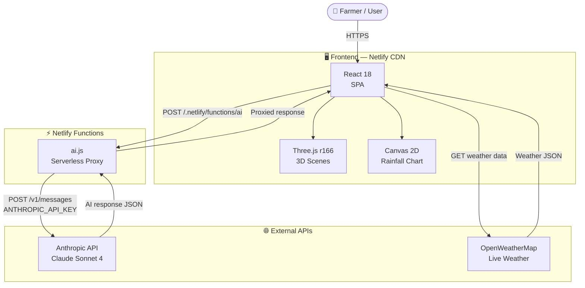
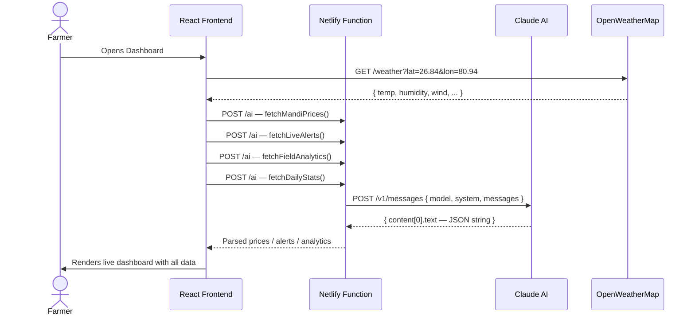
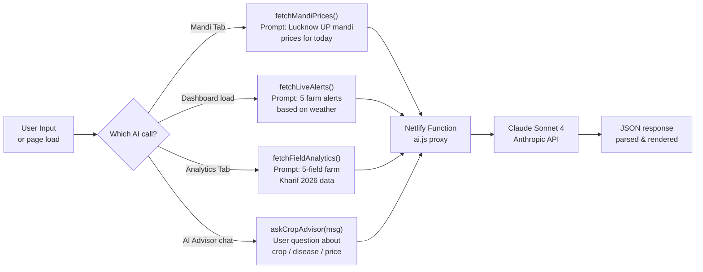
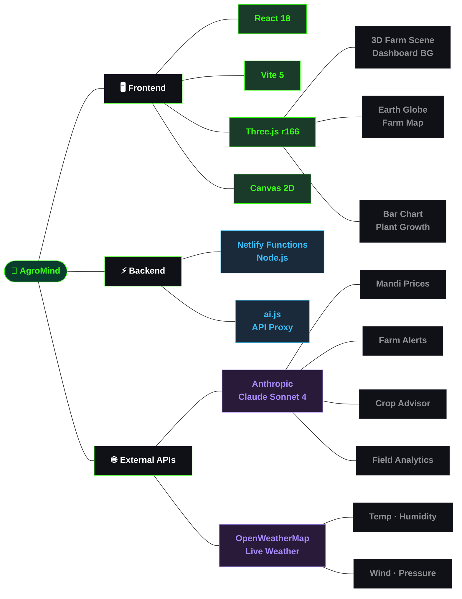

<div align="center">

<!-- Animated Banner -->


<!-- Live Status Badges -->
<p>
  <a href="https://your-deployed-url.netlify.app" target="_blank">
    
  </a>
  
  
  
  
  
</p>

<!-- Quick Nav -->
<p>
  <a href="#-live-demo"><strong>🌐 Live Demo</strong></a> •
  <a href="#-features"><strong>✨ Features</strong></a> •
  <a href="#-architecture"><strong>🏗 Architecture</strong></a> •
  <a href="#-pages"><strong>📄 Pages</strong></a> •
  <a href="#-tech-stack"><strong>🛠 Tech Stack</strong></a> •
  <a href="#-quick-start"><strong>🚀 Quick Start</strong></a> •
  <a href="#-deployment"><strong>☁️ Deploy</strong></a> •
  <a href="#-environment-variables"><strong>🔑 Env Vars</strong></a>
</p>

<br/>

```
╔══════════════════════════════════════════════════════════════════╗
║  🌱 AgroMind  ·  AI-Powered Smart Farming Dashboard             ║
║  ✦ Three.js 3D Farm Scene   ✦ Live Weather API                  ║
║  ✦ Claude AI Crop Advisor   ✦ Live Mandi Prices                 ║
║  ✦ Interactive Globe        ✦ Plant Growth Simulation           ║
╚══════════════════════════════════════════════════════════════════╝
```

</div>

---

## 🌐 Live Demo

| Layer | URL | Status |
|-------|-----|--------|
| 🖥️ **Frontend** | [whimsical-custard-943a95.netlify.app](https://whimsical-custard-943a95.netlify.app) |  |
| ⚡ **AI Function** | `/.netlify/functions/ai` | Netlify Serverless |
| 🌤️ **Weather API** | OpenWeatherMap · Lucknow, UP | Live |

---

## ✨ Features

### 🤖 AI Intelligence
- **Claude AI Crop Advisor** — chat interface powered by Anthropic claude-sonnet-4, gives real advice on crop disease, spray timing, sowing windows
- **Live Mandi Prices** — AI generates realistic current market prices for Lucknow mandis (Aminabad, Lucknow APMC, Amausi)
- **Smart Farm Alerts** — AI-generated alerts for disease risk, weather spray windows, price movements, and PMFBY claims
- **AI Field Analytics** — dynamically generated yield, soil health, and field metrics per Kharif season

### 🌍 3D Visualizations (Three.js)
- **Full-Screen 3D Farm Dashboard** — barn, silo, tractor, wandering cows, crop rows, drone patrol, autumn trees — all animated
- **Interactive Earth Globe** — draggable, zoomable globe with your farm location pinned in neon green
- **3D Farm Parcel Map** — terrain with 5 clickable crop fields, hover tooltips, orbit controls
- **3D Crop Yield Bar Chart** — animated bars that grow on load with hover highlight
- **Plant Growth Simulation** — interactive seed → sprout → sapling → harvest with soil moisture and temperature sliders

### 🌤️ Live Weather
- Real-time temperature, humidity, wind speed, UV index, pressure, visibility
- Powered by OpenWeatherMap API, auto-refreshes every 10 minutes
- Configured for **Lucknow, Uttar Pradesh** (lat: 26.8467, lon: 80.9462)

### 📊 Analytics Engine
- Monthly crop yield bar chart
- Annual rainfall trend line chart (Lucknow district)
- Live metrics: avg yield, rainfall, soil health, active fields

---

## 🏗 Architecture

### System Overview



---

### Request Lifecycle



---

### Data Flow — AI Features



---

## 📄 Pages

| Page | Nav Label | Description |
|------|-----------|-------------|
| **Dashboard** | `DASHBOARD` | Full-screen 3D farm with live weather, field monitor, AI alerts, crop advisor chat |
| **Globe** | `GLOBE` | Interactive 3D Earth, farm location pin, agri zone stats |
| **Farm Map** | `FARM MAP` | 3D terrain with 5 crop parcels, soil health bars, orbit + zoom |
| **Analytics** | `ANALYTICS` | 3D yield chart, rainfall trends, live metrics |
| **Mandi** | `MANDI` | Live AI crop prices, trend arrows, sell/hold advisory |
| **Growth** | `GROWTH` | Plant growth simulation, disease risk meter, 90-day timeline |

---

## 🛠 Tech Stack



### Package Versions

| Category | Package | Version |
|----------|---------|---------|
| UI Framework | `react` + `react-dom` | 18.3.1 |
| Build Tool | `vite` + `@vitejs/plugin-react` | 5.4.1 |
| 3D Graphics | `three` | 0.166.0 |
| AI | Anthropic Claude API | claude-sonnet-4-20250514 |
| Weather | OpenWeatherMap REST | v2.5 |
| Deployment | Netlify | Functions + CDN |

---

## 🚀 Quick Start

### Prerequisites

- Node.js v18+
- npm v9+
- Free API keys (see below)

### Installation

```bash
# 1. Clone the repository
git clone https://github.com/YOUR_USERNAME/agromind.git
cd agromind

# 2. Install dependencies
npm install

# 3. Create environment file
touch .env
```

Add to `.env`:

```env
VITE_OPENWEATHER_KEY=your_openweathermap_key_here
ANTHROPIC_API_KEY=your_anthropic_key_here
```

```bash
# 4. Run locally (basic — no AI functions)
npm run dev

# OR with Netlify CLI (full AI features locally)
npm install -g netlify-cli
netlify dev
```

Open [http://localhost:3000](http://localhost:3000)

> ⚠️ AI features (Mandi prices, alerts, crop advisor) need Netlify Functions. Use `netlify dev` for full local testing, or just deploy to Netlify.

---

## 🔑 Environment Variables

| Variable | Where to get | Required |
|----------|-------------|---------|
| `VITE_OPENWEATHER_KEY` | [openweathermap.org](https://openweathermap.org/api) — free | ✅ Yes |
| `ANTHROPIC_API_KEY` | [console.anthropic.com](https://console.anthropic.com) | ✅ Yes |

> 🔒 Never commit your `.env` file. Add it to `.gitignore`.

---

## ☁️ Deployment

### Deploy on Netlify (Recommended)

```bash
# 1. Push to GitHub
git add .
git commit -m "initial commit"
git push origin main
```

**2.** Go to [netlify.com](https://netlify.com) → **Add new site** → **Import from GitHub**

**3.** Build settings are auto-detected from `netlify.toml`:

```toml
[build]
  command = "npm run build"
  publish = "dist"

[functions]
  directory = "netlify/functions"
```

**4.** Add environment variables in Netlify Dashboard:
- **Site Settings → Environment Variables**
- Add `ANTHROPIC_API_KEY` and `VITE_OPENWEATHER_KEY`

**5.** Click **Trigger deploy** → live in ~2 minutes at:
```
https://agromind.netlify.app
```

---

## 📁 Project Structure

```
agromind/
├── 📄 index.html                    # App shell
├── ⚙️  vite.config.js               # Vite config
├── 📦 package.json                  # Dependencies
├── 🌐 netlify.toml                  # Netlify build + functions config
├── 🔺 vercel.json                   # Vercel deploy config (alternative)
├── 🔒 .env                          # API keys — never commit this
│
├── src/
│   ├── ⚛️  main.jsx                 # React root mount
│   └── 🌱 App.jsx                   # Entire app — all pages + components
│                                    # (2200 lines — Globe, FarmMap, Analytics,
│                                    #  Mandi, Growth, Dashboard, Nav, AI hooks)
│
└── netlify/
    └── functions/
        └── ⚡ ai.js                 # Serverless proxy — forwards requests
                                     # to Anthropic API securely
```

---

## 🗺️ Location Config

The app is configured for **Lucknow, Uttar Pradesh**. To change location, edit these lines in `src/App.jsx`:

```js
const GORAKHPUR_LAT = 26.8467;   // ← your latitude
const GORAKHPUR_LON = 80.9462;   // ← your longitude
```

And update city name references (search for `"Lucknow"` in App.jsx).

---

## 📊 Platform Overview

```
┌──────────────────────────────────────────────────────┐
│   🌾 6 Pages      🤖 Claude AI     🌍 3D Globe       │
│   📊 Analytics    🌤️ Live Weather  🚁 Drone Patrol   │
│   📈 Mandi Prices 🌱 Growth Sim    🗺️ Farm Map       │
└──────────────────────────────────────────────────────┘
```

### AI Features Summary

| Feature | Model | Prompt Type |
|---------|-------|-------------|
| Mandi Prices | claude-sonnet-4 | Structured JSON |
| Farm Alerts | claude-sonnet-4 | JSON array |
| Field Analytics | claude-sonnet-4 | Structured JSON |
| Crop Advisor Chat | claude-sonnet-4 | Conversational |
| Daily Stats | claude-sonnet-4 | Structured JSON |

---

## 🤝 Contributing

Contributions welcome!

```bash
# 1. Fork the repo
# 2. Create your branch
git checkout -b feature/your-feature-name

# 3. Commit your changes
git commit -m "Add: your feature description"

# 4. Push and open a Pull Request
git push origin feature/your-feature-name
```

### Guidelines
- One feature per PR
- Test locally before submitting
- Keep code commented and clean
- Follow existing style in `App.jsx`

---

## 📄 License

MIT License — see [LICENSE](LICENSE) for details.

---

## 👤 Author

**[Your Name]**

- GitHub: [@your-username](https://github.com/your-username)
- LinkedIn: [your-linkedin](https://linkedin.com/in/your-profile)
- Email: your@email.com

---

<div align="center">

## ⭐ If AgroMind helped you, give it a star!


**Built with ❤️ for Indian Farmers · Powered by Claude AI · Three.js · React · OpenWeatherMap**

</div>
