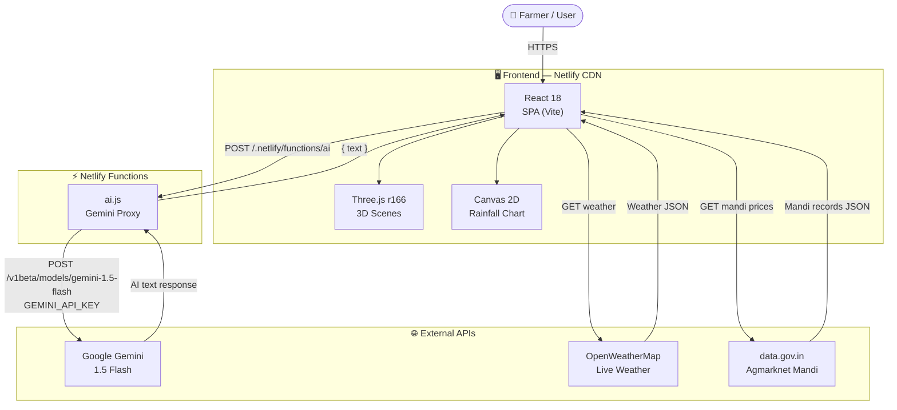
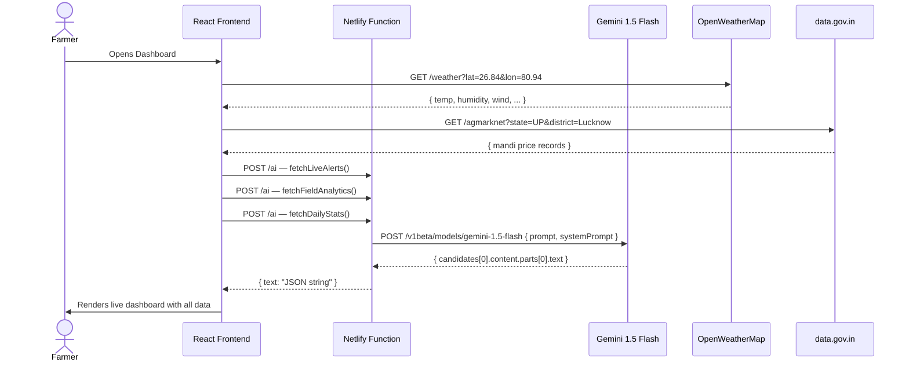
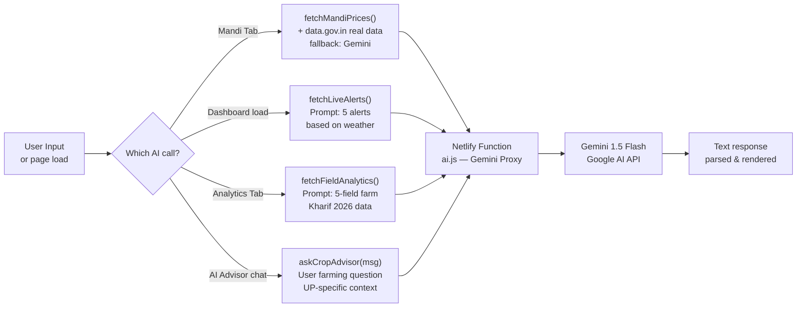
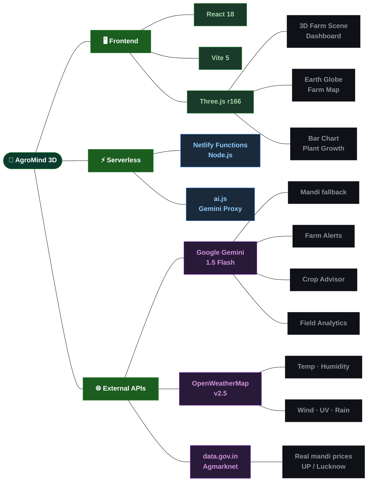

<div align="center">

<!-- Animated Banner -->


<!-- Live Status Badges -->
<p>
  <a href="https://whimsical-custard-943a95.netlify.app" target="_blank">
    
  </a>
  <a href="https://whimsical-custard-943a95.netlify.app/.netlify/functions/ai" target="_blank">
    
  </a>
  
  
  
  
  
  
</p>

<!-- Quick Nav -->
<p>
  <a href="#-live-demo"><strong>🌐 Live Demo</strong></a> •
  <a href="#-features"><strong>✨ Features</strong></a> •
  <a href="#-architecture"><strong>🏗 Architecture</strong></a> •
  <a href="#-pages"><strong>📄 Pages</strong></a> •
  <a href="#-tech-stack"><strong>🛠 Tech Stack</strong></a> •
  <a href="#-quick-start"><strong>🚀 Quick Start</strong></a> •
  <a href="#-deployment"><strong>☁️ Deploy</strong></a> •
  <a href="#-environment-variables"><strong>🔑 Env Vars</strong></a>
</p>

<br/>

```
╔══════════════════════════════════════════════════════════════════╗
║  🌱 AgroMind 3D  ·  AI-Powered Smart Farming Dashboard          ║
║  ✦ Three.js 3D Farm Scene   ✦ Live Weather API                  ║
║  ✦ Gemini AI Crop Advisor   ✦ Real Mandi Prices (data.gov.in)   ║
║  ✦ Interactive Globe        ✦ Plant Growth Simulation           ║
╚══════════════════════════════════════════════════════════════════╝
```

</div>

---

## 🌐 Live Demo

| Layer | URL | Status |
|-------|-----|--------|
| 🖥️ **Frontend** | [whimsical-custard-943a95.netlify.app](https://whimsical-custard-943a95.netlify.app) |  |
| ⚡ **AI Function** | [/.netlify/functions/ai](https://whimsical-custard-943a95.netlify.app/.netlify/functions/ai) | Netlify Serverless |
| 🌤️ **Weather API** | [OpenWeatherMap · Lucknow, UP](https://openweathermap.org/api) | Live |
| 🏪 **Mandi API** | [data.gov.in · Agmarknet](https://api.data.gov.in/resource/9ef84268-d588-465a-a308-a864a43d0070) | Live |

---

## ✨ Features

### 🤖 AI Intelligence (Google Gemini 1.5 Flash)

- **Gemini AI Crop Advisor** — real chat interface powered by `gemini-1.5-flash`, gives practical advice on crop disease, spray timing, sowing windows, and pest management specific to UP farming
- **Live Mandi Prices** — AI + real data.gov.in Agmarknet API for Lucknow mandis (Aminabad, Lucknow APMC, Amausi) with trend arrows and sell/hold advisory
- **Smart Farm Alerts** — AI-generated alerts for disease risk, weather spray windows, price movements, and PMFBY claims — refreshes every 10 minutes
- **AI Field Analytics** — dynamically generated yield, soil health, and field metrics per Kharif 2026 season

### 🌍 3D Visualizations (Three.js r166)

- **Full-Screen 3D Farm Dashboard** — barn, silo, tractor, wandering cows with collision avoidance, crop rows, drone patrol, autumn trees — all animated in real-time
- **Interactive Earth Globe** — draggable, zoomable 3D globe with Lucknow farm location pinned
- **3D Farm Parcel Map** — terrain with 5 clickable crop fields (Wheat, Rice, Cotton, Sugarcane, Veg Garden), hover tooltips, orbit controls
- **3D Crop Yield Bar Chart** — animated bars that grow on load with hover highlight
- **Plant Growth Simulation** — interactive seed → sprout → sapling → harvest with soil moisture, temperature sliders, disease risk meters

### 🌤️ Live Weather (OpenWeatherMap)

- Real-time temperature, humidity, wind speed, UV index, pressure, visibility
- Powered by OpenWeatherMap API, auto-refreshes every 10 minutes
- Configured for **Lucknow, Uttar Pradesh** (lat: 26.8467, lon: 80.9462)
- Fallback to realistic static data if API unavailable

### 📊 Analytics Engine

- Monthly crop yield bar chart with animated reveals
- Annual rainfall trend line chart (Lucknow district)
- Live metrics: avg yield, rainfall, soil health, active fields
- Real-time data powered by Gemini AI

---

## 🏗 Architecture

### System Overview



---

### Request Lifecycle



---

### Data Flow — AI Features



---

## 📄 Pages

| Page | Nav Label | Description |
|------|-----------|-------------|
| 🏠 Dashboard | `HOME` | Full-screen 3D farm with live weather strip, field monitor cards, AI alerts, AI crop advisor chat, quick access modules |
| 🌍 Globe | `GLOBE` | Interactive 3D Earth, Lucknow farm location pin, agricultural zone stats (150M+ farmers, 28 zones) |
| 🗺️ Farm Map | `FARM` | 3D terrain with 5 crop parcels, soil health bars by zone, parcel legend, orbit + zoom |
| 📊 Analytics | `ANALYTICS` | 3D yield bar chart, Lucknow rainfall trend line, live metrics (yield, rainfall, soil health) |
| 💰 Mandi | `MANDI` | Real Agmarknet crop prices (Wheat, Rice, Cotton, Sugarcane, Potato, Mustard), trend arrows, sell/hold advisory |
| 🌱 Growth | `GROWTH` | Plant growth simulation, disease & stress risk meters, 90-day wheat growth timeline |

---

## 🛠 Tech Stack



### Package Versions

| Category | Package | Version |
|----------|---------|---------|
| UI Framework | `react` + `react-dom` | 18.3.1 |
| Build Tool | `vite` + `@vitejs/plugin-react` | 5.4.1 |
| 3D Graphics | `three` | 0.166.0 |
| AI | Google Gemini API | `gemini-1.5-flash` |
| Weather | OpenWeatherMap REST | v2.5 |
| Mandi | data.gov.in Agmarknet | REST API |
| Deployment | Netlify | Functions + CDN |

---

## 🚀 Quick Start

### Prerequisites

- Node.js v18+
- npm v9+
- Free API keys (see below)

### Installation

```bash
# 1. Clone the repository
git clone https://github.com/YOUR_USERNAME/agromind3d.git
cd agromind3d

# 2. Install dependencies
npm install

# 3. Create environment file
touch .env
```

Add to `.env`:

```env
VITE_OPENWEATHER_KEY=your_openweathermap_key_here
VITE_GEMINI_KEY=your_gemini_key_here
```

```bash
# 4. Run locally
npm run dev
```

Open [http://localhost:3000](http://localhost:3000)

> ⚠️ AI features (Mandi prices fallback, alerts, crop advisor) use Netlify Functions.
> For full local AI testing, use Netlify CLI:

```bash
# Install Netlify CLI
npm install -g netlify-cli

# Run with full functions support
netlify dev
```

---

## 🔑 Environment Variables

### Frontend (`.env`)

| Variable | Where to get | Required |
|----------|-------------|----------|
| `VITE_OPENWEATHER_KEY` | [openweathermap.org](https://openweathermap.org/api) — free signup | ✅ Yes |
| `VITE_GEMINI_KEY` | [aistudio.google.com](https://aistudio.google.com) — free | ✅ Yes |

### Netlify Function (`netlify/functions/ai.js`)

| Variable | Where to set | Required |
|----------|-------------|----------|
| `GEMINI_API_KEY` | Netlify Dashboard → Site Config → Environment Variables | ✅ Yes |
| `VITE_OPENWEATHER_KEY` | Netlify Dashboard → Site Config → Environment Variables | ✅ Yes |

> 🔒 Never commit your `.env` file. It's already in `.gitignore`.

---

## ☁️ Deployment

### Deploy on Netlify (Recommended — Free)

```bash
# 1. Push to GitHub
git add .
git commit -m "initial commit"
git push origin main
```

2. Go to [netlify.com](https://netlify.com) → **Add new site** → **Import from GitHub**

3. Build settings are auto-detected from `netlify.toml`:

```toml
[build]
  command = "npm run build"
  publish = "dist"

[functions]
  directory = "netlify/functions"

[[redirects]]
  from = "/*"
  to = "/index.html"
  status = 200
```

4. Add environment variables in **Netlify Dashboard**:

**Site Configuration → Environment Variables → Add variable**

| Key | Value |
|-----|-------|
| `GEMINI_API_KEY` | Your Google Gemini API key |
| `VITE_OPENWEATHER_KEY` | Your OpenWeatherMap key |

5. Click **Trigger deploy** → live in ~2 minutes at:

```
https://whimsical-custard-943a95.netlify.app
```

---

## 📁 Project Structure

```
agromind3d/
├── 📄 index.html                    # App shell
├── ⚙️  vite.config.js               # Vite config
├── 📦 package.json                  # Dependencies
├── 🌐 netlify.toml                  # Netlify build + functions config
├── 🔺 vercel.json                   # Vercel deploy config (alternative)
├── 🔒 .env                          # API keys — never commit!
│
├── src/
│   ├── ⚛️  main.jsx                 # React root mount
│   └── 🌱 App.jsx                   # Entire app — all pages + components
│                                    # (~2200 lines — Globe, FarmMap, Analytics,
│                                    #  Mandi, Growth, Dashboard, Nav, AI hooks)
│
└── netlify/
    └── functions/
        └── ⚡ ai.js                 # Serverless Gemini proxy — forwards
                                     # requests to Google AI securely
```

---

## 🗺️ Location Config

The app is configured for **Lucknow, Uttar Pradesh**. To change location, edit these constants in `src/App.jsx`:

```js
const LUCKNOW_LAT = 26.8467;   // ← your latitude
const LUCKNOW_LON = 80.9462;   // ← your longitude
```

And search + replace **"Lucknow"** in `App.jsx` for city name references.

---

## 📊 Platform Overview

```
┌──────────────────────────────────────────────────────────────┐
│   🌾 6 Pages        🤖 Gemini AI      🌍 3D Globe           │
│   📊 Analytics      🌤️ Live Weather   🚁 Drone Patrol       │
│   💰 Mandi Prices   🌱 Growth Sim     🗺️ Farm Map           │
│   🏪 data.gov.in    ⚡ Netlify Fn     📱 Responsive          │
└──────────────────────────────────────────────────────────────┘
```

### AI Features Summary

| Feature | Model | Type |
|---------|-------|------|
| Mandi Prices (fallback) | `gemini-1.5-flash` | Structured JSON |
| Farm Alerts | `gemini-1.5-flash` | JSON array |
| Field Analytics | `gemini-1.5-flash` | Structured JSON |
| Crop Advisor Chat | `gemini-1.5-flash` | Conversational |
| Daily Stats | `gemini-1.5-flash` | Structured JSON |

### Live Data Sources

| Data | Source | Refresh |
|------|--------|---------|
| Weather | OpenWeatherMap API | Every 10 min |
| Mandi Prices | data.gov.in Agmarknet | On page load |
| Farm Alerts | Gemini AI | Every 10 min |
| Field Analytics | Gemini AI | On page load |

---

## 🤝 Contributing

Contributions welcome!

```bash
# 1. Fork the repo
# 2. Create your branch
git checkout -b feature/your-feature-name

# 3. Commit your changes
git commit -m "Add: your feature description"

# 4. Push and open a Pull Request
git push origin feature/your-feature-name
```

**Guidelines:**
- One feature per PR
- Test locally before submitting
- Keep code commented and clean
- Follow existing style in `App.jsx`

---

## 👤 Author

**Zara Alam**
- GitHub: [@zara650](https://github.com/zara650)
- LinkedIn: [zara-alam-73b9b1322](https://www.linkedin.com/in/zara-alam-73b9b1322)
- Email: [zalam9414@gmail.com](mailto:zalam9414@gmail.com)

---

## 📄 License

MIT License — free to use, modify and distribute.

---

<div align="center">

⭐ **If AgroMind helped you, give it a star!**


**Built with ❤️ for Indian Farmers · Powered by Gemini AI · Three.js · React · OpenWeatherMap · data.gov.in**

</div>
